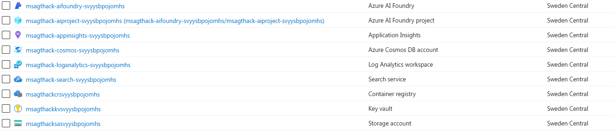

# 1. Environment Creation and Resources Deployment

Welcome to your very first challenge! Your goal in this challenge is to create the services and enviornment necessary to conduct this hackathon. You will deploy the required resources in Azure, create your development enviornment and all the assets necessary for the subsequent challenges. By completing this challenge, you will set up the foundation for the rest of the hackathon. 

If something is not working correctly, please do let your coach know!


## 1.1 Preparation

Before you start, please fork this repository to your GitHub account by clicking the `Fork` button in the upper right corner of the repository's main screen (or follow the [documentation](https://docs.github.com/en/pull-requests/collaborating-with-pull-requests/working-with-forks/fork-a-repo#forking-a-repository)). This will allow you to make changes to the repository and save your progress.

## 1.2 Resource Deployment Guide
The first step on this hackathon will be to create the resources we will use throughout the day. You can deploy using either the one-click button or manual method below.

### Method 1: One-Click Deploy
[](https://portal.azure.com/#create/Microsoft.Template/uri/https%3A%2F%2Fraw.githubusercontent.com%2Fmartaldsantos%2Fagentic-ai-hack%2Fmain%2Fchallenge-0%2Fiac%2Fazuredeploy.json)

### Method 2: Manual Deploy (if button doesn't work)
If the above button gives a CORS error, follow these steps:

1. **Download the template**: Right-click [this link](https://raw.githubusercontent.com/martaldsantos/agentic-ai-hack/main/challenge-0/iac/azuredeploy.json) and save the JSON file
2. **Open Azure Portal**: Go to [portal.azure.com](https://portal.azure.com)
3. **Create Custom Deployment**: Search for "Deploy a custom template" or go to [Custom deployment](https://portal.azure.com/#create/Microsoft.Template)
4. **Upload template**: Click "Upload a file" and select the downloaded JSON file
5. **Configure**: Select subscription, resource group, and region
6. **Deploy**: Click "Review + create" then "Create"

**NOTE:** Deployment may fail if the resource provider `Microsoft.AlertsManagement` is not registered in your. Follow the [documentation](https://learn.microsoft.com/en-us/azure/azure-resource-manager/management/resource-providers-and-types#register-resource-provider-1) to register it and the re-run the deployment.

Resource deployment can take up to 5 minutes. Once the deployment is complete, you will see the resources in your Azure portal.

In the meantime, you can proceed with the next step - opening a pre-configured development environment in GitHub Codespaces.

## 1.3 Development Environment

GitHub Codespaces is a cloud-based development environment that allows you to code from anywhere. It provides a fully configured environment that can be launched directly from any GitHub repository, saving you from lengthy setup times. You can access Codespaces from your browser, Visual Studio Code, or the GitHub CLI, making it easy to work from virtually any device.

To open GitHub Codespaces, click on the button below:

[](https://codespaces.new/)

Please select your forked repository from the dropdown and, if necessary, adjust other settings of GitHub Codespace.

**NOTE:** If GitHub Codespaces is not enabled in your organization, you can enable it by following the instructions [here](https://docs.github.com/en/codespaces/managing-codespaces-for-your-organization/enabling-or-disabling-github-codespaces-for-your-organization), or, if you cannot change your GitHub organization's settings, create a free personal GitHub account [here](https://github.com/signup?ref_cta=Sign+up&ref_loc=header+logged+out&ref_page=%2F&source=header-home). The Github Free Plan includes 120 core hours per month, equivalent to 60 hours on a 2-core machine, along with 15 GB of storage.

## 1.4 Verify the creation of your resources

Go back to your `Azure Portal` and find your `Resource Group`that should by now contain 9 resources and look like this:



## 1.5 Let's retrieve the necessary keys
After deploying the resources, you will need to configure the environment variables in the `.env` file. The `.env` file is a configuration file that contains the environment variables for the application. The `.env` file is automatically created running the following command within the terminal in your Codespace:

```bash
cd challenge-0 && ./get-keys.sh --resource-group <resource-group-name>
```

This script will connect to Azure and fetch the necessary keys and populate the `.env` file with the required values in the root directory of the repository. If needed, script will prompt you to sign in to your Azure account.


## 1.6 Verify `.env` setup

When the script is finished, review the `.env` file to ensure that all the values are correct. If you need to make any changes, you can do so manually.

The repo has an `.env.sample` file that shows the relevant environment variables that need to be configured in this project. The script should create a `.env` file that has these same variables _but populated with the right values_ for your Azure resources.

If the file is not created, simply copy over `.env.sample` to `.env` - then populate those values manually from the respective Azure resource pages using the Azure Portal.

## Conclusion
By reaching this section you should have every resource and installed the requirements necessary to conduct the hackathon. In the next challenges, you will use these services to start strongly your Azure AI Agents journey.

Now the real fun begins!