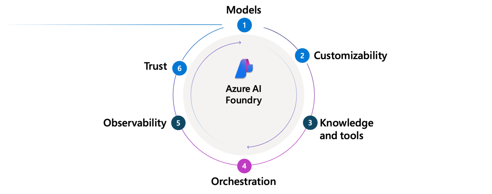
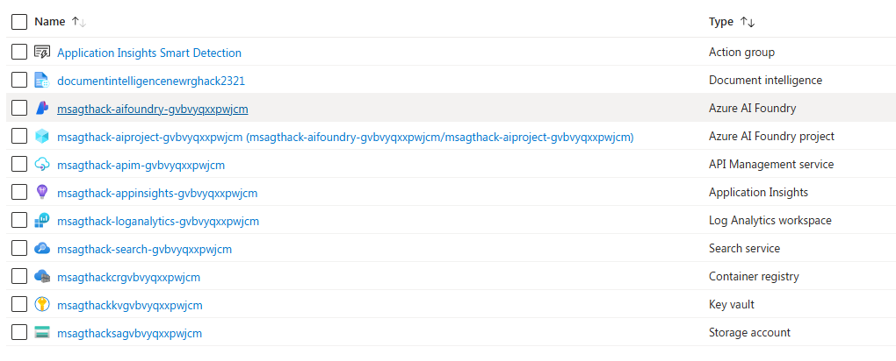
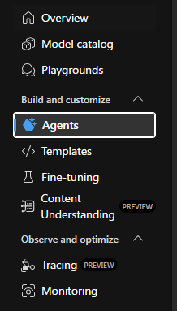
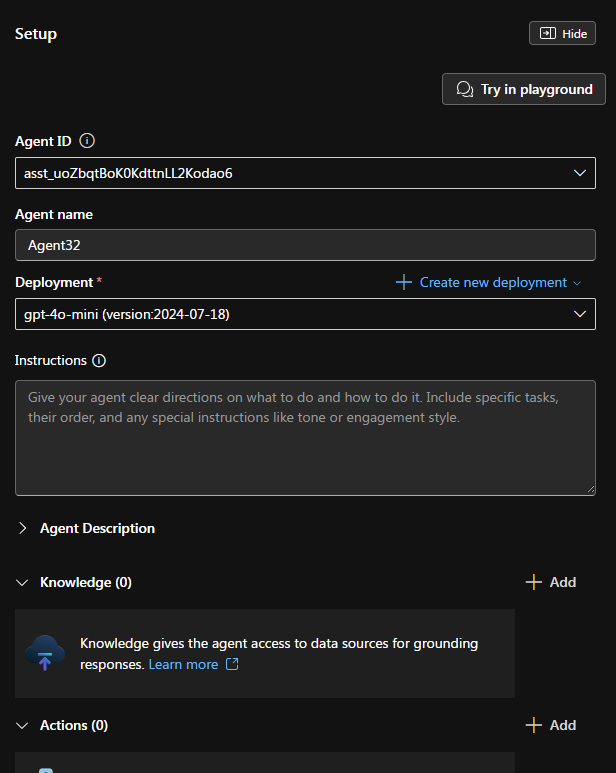
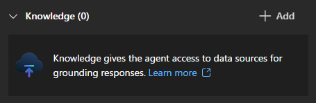
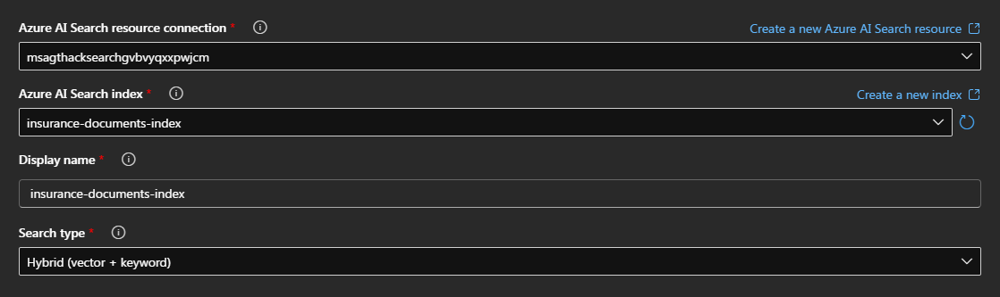

# Challenge 2 - Build and test your first Agent

**Expected Duration:** 120 minutes

## Introduction

Welcome to Challenge 2! This challenge focuses on building your first intelligent agent using Azure AI Agent Service to handle insurance claim processing workflows. You'll learn how to create, configure, and test an AI agent that can analyze insurance claims, validate policies, and provide intelligent responses to claim-related queries.

## 🎯 How do agents in AI Foundry work?

Think of Azure AI Foundry as an assembly line for intelligent agents. Like any modern factory, it brings together different specialized stations, each responsible for shaping part of the final product. Instead of machines and conveyor belts, the Agent Factory uses models, tools, policies, and orchestration to build agents that are secure, testable, and production-ready. Here’s how the factory works step by step:



1. **Models:** Choose a core large language model (e.g., GPT-4o, Llama) to power your agent's reasoning capabilities.
2. **Customization:** Tailor the model for your use case using fine-tuning, prompt engineering, or domain-specific data.
3. **AI Tools:** Extend your agent’s abilities with tools that enable knowledge access and real-world actions.
4. **Orchestration:** Coordinate agent workflows including tool use, state management, and logging through orchestration.
5. **Observability:** Monitor and evaluate agents with full traceability and logging to ensure performance and reliability.
6. **Trust:** Secure your agents with identity management, RBAC, content filtering, and infrastructure controls.

In this Challenge 2, we will dedicate half of the time dedicating our time on: **Part 1) Customizability and Part 2) Knowledge and tools.**

## 📋 Pre-requisites

Before starting this challenge, ensure you have completed:
- **Challenge 0**: Environment setup and Azure resource deployment
- **Challenge 1**: Document processing and vectorized search setup

You will need:
- Azure AI Agent Service enabled in your subscription
- Access to the Azure AI Search index from Challenge 1
- Azure OpenAI service with GPT-4 model deployed

## 🛠️ Implementation Tasks

### Option 1 - Creating your Agent Backbone - On the Portal

1. Navigate to the Azure portal and login with your account.
2. Navigate to your resource group.
3. Click on the `Azure AI Foundry resource`


4. Click on the blue button on the center part of your screen that says `Go to Azure AI Foundry Portal`
5. This previous step will open the Azure AI Foundry Portal also accessible through the link [ai.azure.com](ai.azure.com). On your left hand side you can find the Agents section.
 


7. Click on the blue button `New Agent` to create your first agent.


A new window will appear on your right hand side, that allows you to configure your agent. Your setup should look like this and contain the following components:
   
<div style="display: flex; align-items: flex-start; gap: 20px;">
<div style="flex: 1;">

1. **Agent ID**
A unique identifier automatically assigned to each AI agent instance for internal referencing and management within Azure's ecosystem.
2. **Agent Name**
A customizable label for the AI agent to make it easier to identify and manage within your environment.
3. **Deployment**
Determines which AI model and version the agent will use (e.g., "gpt-4o-mini").
4. **Instructions**
A text field where you define the agent's operating instructions to specify tasks, rules, tone, or engagement style.
5. **Agent Description**
A supplementary section for providing a detailed explanation of the agent's purpose, scope, or intended use case.
6. **Knowledge**
A feature that allows the agent to access external data sources or knowledge bases to improve response accuracy and relevance.
7. **Actions**
Lets you define custom operations that the agent can perform, such as API calls, workflow integrations, or invoking external services.
8. **Connected Agents**
Enables integration of multiple agents, allowing them to communicate or collaborate to accomplish more complex tasks.

</div>
<div style="flex: 1;">



</div>
</div>

7. Given this information, it's time to personalize your first agent! Give it a nice name like `Policy Checker`.
8. Please set the `Instructions` accordingly to what you want it to do! 

```
You are an expert Insurance Policy Checker Agent specialized in analyzing auto insurance policies and validating claim coverage. Your primary responsibilities include:

**Core Functions:**
- Analyze insurance policy documents to determine coverage details
- Validate if specific claims are covered under policy terms
- Explain policy limits, deductibles, and exclusions
- Identify coverage gaps or restrictions
- Provide clear explanations of policy benefits

**Policy Types You Handle:**
- Commercial Auto Policies
- Comprehensive Auto Policies  
- High Value Vehicle Policies
- Liability Only Policies
- Motorcycle Policies

**Analysis Guidelines:**
1. Always reference specific policy sections when providing coverage determinations
2. Clearly state coverage limits, deductibles, and any applicable restrictions
3. Identify any exclusions that may apply to the claim
4. Be precise about effective dates and policy periods
5. Flag any discrepancies between claim details and policy terms

**Response Format:**
- Start with a clear coverage determination (COVERED/NOT COVERED/PARTIAL COVERAGE)
- Provide the specific policy section reference
- Explain coverage limits and deductibles
- List any relevant exclusions or conditions
- Suggest next steps if coverage issues exist

**Tone:** Professional, accurate, and helpful. Always be thorough in your analysis while remaining clear and concise.

When you cannot find specific information in the policy documents, clearly state what information is missing and what additional documentation would be needed.
```
9. Now let's add knowledge to it! We have already created the vector knowledge base that will be used on our use case. We have successfully processed in Challenge 1 the vectorization of the policies of our Contoso Insurance Banking. 
10. Please click on the `Add` button on the knowledge section and then select `Azure AI Search`



11. Now, when prompted, click on `Indexes that are not part of this project`. 
12. On the `Azure AI Search resource connection` section, click on the drop down option. If you have no pre-selected resource, click on `Connect other Azure AI search resource`. You should have only one option, the service we previously connected. Click on `Add Connection`. 
13. To finish the connection to your Azure AI Search, please fill the fields in such a way to return
the following options:




14. Perfect! Now on the top right-hand side of your screen click on `Try on Playground`.
15. Time to prompt! Let's explore our vector knowledge base before giving any Action step to our Agent. So far, we have done the equivalent of a normal RAG scenario. 

```
I have policy POL-AUTO-12345 and was in a rear-end collision. Is this covered under my policy? The damage estimate is $3,500.
```

```
Make a summary of the last claim from License plate OH - GHR1984
```

```
My 17-year-old son was driving my car when the accident happened. Are we still covered under policy POL-AUTO-33333?
```

### Option 2 - Creating your Agent Backbone - On the Portal

So far, we have created the beggining of our agent using Azure AI Agent Service in the Portal. Now, **let's start coding!** Our Agent, as of now, is able to access our Azure AI Search, our Vector Database. This is, essentially, your first tool they can access.

Please jump over to the `policy_checker.ipynb` file to complete this guide.
