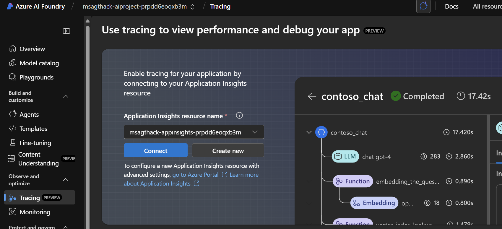
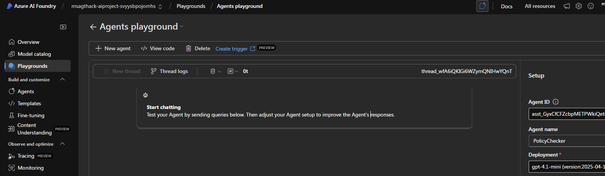
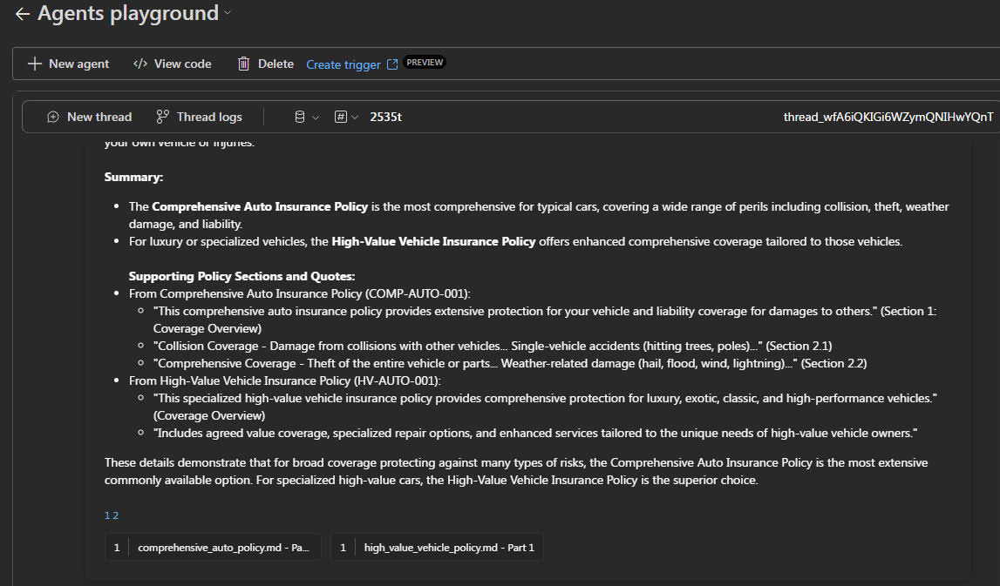
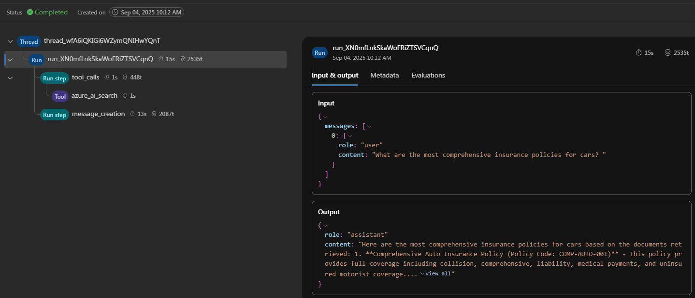
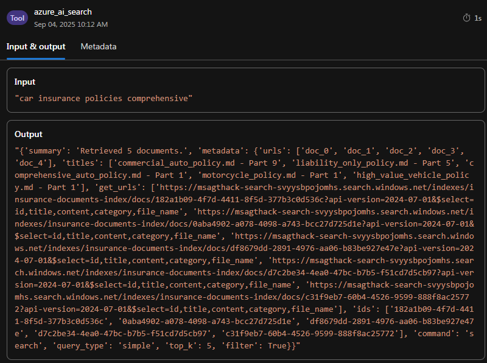

# Challenge 3 - Agent Observability and Evaluation

**Expected Duration:** 30 minutes

## Introduction

Welcome to Challenge 3! This challenge focuses on implementing comprehensive observability and evaluation frameworks for your AI agents using Azure AI Foundry's evaluation capabilities. You'll learn how to systematically assess agent performance, implement continuous monitoring, and ensure your agents meet quality, safety, and reliability standards throughout their lifecycle.

Building on the agent foundations from Challenge 2, you'll now implement the critical observability layer that enables you to:
- Monitor agent performance in real-time
- Evaluate response quality and accuracy
- Assess safety and security vulnerabilities
- Implement continuous evaluation pipelines
- Build trust through systematic assessment

## 🎯 Understanding Observability in GenAI

Observability in generative AI encompasses three critical stages of the **GenAIOps evaluation lifecycle**:

### 1. **Base Model Selection**
Before building your application, evaluate foundation models based on:
- Quality and accuracy of responses
- Task performance efficiency  
- Ethical considerations and bias detection
- Safety profile assessment

### 2. **Pre-Production Evaluation**
Thorough testing before deployment through:
- Testing with evaluation datasets that simulate realistic user interactions
- Identifying edge cases and response quality degradation
- Assessing robustness across input variations
- Measuring key metrics (groundedness, relevance, safety)

### 3. **Post-Production Monitoring**
Continuous monitoring after deployment for:
- Performance tracking of key metrics
- Incident identification and response
- Real-time quality and safety assessment
- User experience maintenance

## 🛠️ Implementation Components

### 1. Agent Performance Evaluation
Azure AI Foundry provides several main categories of built-in evaluators to comprehensively assess your AI agents. Here are some of the most common ones:

1. [**RAG evaluators**](https://learn.microsoft.com/en-us/azure/ai-foundry/concepts/evaluation-evaluators/rag-evaluators) measure retrieval effectiveness, response groundedness, relevance, and completeness - essential for knowledge-based agents. 
2. [**Agent-specific evaluators** (in preview)](https://learn.microsoft.com/en-us/azure/ai-foundry/concepts/evaluation-evaluators/agent-evaluators) assess core agent capabilities including intent resolution accuracy, task adherence, and tool call precision. 
3. [**Safety and security evaluators** (in preview)](https://learn.microsoft.com/en-us/azure/ai-foundry/concepts/evaluation-evaluators/risk-safety-evaluators) provide comprehensive protection by detecting harmful content (violence, sexual content, self-harm), bias and unfairness, code vulnerabilities, and unauthorized use of protected materials. 

These evaluators work together to ensure your agents maintain high quality, safety, and reliability standards across all interactions, with built-in metrics that help you track performance against industry benchmarks and identify areas for improvement.

Get to know more about other types of evaluators and **how to build your own** evaluator on the official [documentation page](https://learn.microsoft.com/en-us/azure/ai-foundry/concepts/evaluation-evaluators/general-purpose-evaluators).

### Advanced Evaluation Techniques

#### **AI Red Teaming Agent (Preview)**
Implement automated adversarial testing:
- Complex adversarial attack simulations
- Safety and security vulnerability assessment
- Systematic risk identification before deployment
- Integration with Microsoft's PyRIT framework

#### **Simulation-Based Testing**
- **Adversarial Simulators**: Generate attack-like queries for edge case testing
- **Context-Appropriate Simulators**: Create realistic user conversation simulations
- **Custom Evaluation Datasets**: Build domain-specific test scenarios

### Continuous Monitoring Pipeline
Set up production monitoring:
- Real-time performance tracking
- Automated quality assessment
- Safety incident detection and response
- Integration with Azure Monitor Application Insights

## 🔍 Guide - Evaluation and Observability Implementation

### Part 1. **Evaluation Dataset Preparation**

To start an evaluation for a lot of scenarios you will need a testing dataset. A lot of times, you want to make sure to include a breatdth of data on your testing dataset to be able to capture every nuance that might exist. For that, Microsoft has developed the [Simulator class](https://learn.microsoft.com/en-us/azure/ai-foundry/how-to/develop/simulator-interaction-data) that enables synthetic data generation to address limited production data challenges. 

The simulator creates query-response pairs from text sources, realistic conversation simulations, and adversarial datasets for safety testing. 

This supports both non-adversarial scenarios (conversational testing, training data) and adversarial simulations (jailbreak attacks, safety evaluation), enabling comprehensive insurance domain test scenarios and automated data generation pipelines.All you need to do is connected it to your datasource and let the Generator do it's magic! 

Don't worry, step 1 has already been completed for this challenge. You can find the query-response pairs as the `eval-queries.json` file. Have a look at it, and jump over to Part 2.

### Part 2. **Running the Agent evaluation locally**
Now it's time to go back to our terminal, where we will run our `agent-evaluator.py` file. Copy and Paste the following code onto the terminal:

```bash
cd challenge-3 && python agent-evaluator.py
```
Have a look at the code in it, run it, and then jump over to the output file `eval-output-simple.json` to have a look at all the logs and evaluations of each one of the queries that were run. You can also see as an output on your terminal a table that summarizes the evaluation on the 5 queries we evaluated!

## Part 3. Oh-oh... something doesn't seem right? Let's trace it!

A really important part of your system is to understand every part of it. For observability, the Azure AI Foundry provides the option to Trace the steps inside your application. Here you have the option to trace every run and message of your agent or application through the Portal or through the Azure AI Foundry SDK! 

1. Go back to the Foundry Portal, and on the left-hand side you will find the button `Tracing`


2. On the centre of your screen you'll find the blue button that allows you to connect to your Application Insights service (already deployed in challenge-0) that brings the observability capabilities to the Foundry Portal.

3. Now jump over to your `Playground` and select your Policy Checker agent and start a session with your agent.



4. Now, let's try out our agent and understand what happens underneath. To perform such action, let's ask a question related to the policies our agent has available. Copy and paste the following message on your Playground:

```
What are the most comprehensive insurance policies for cars?
```

5. You should see a screen similar to this one:



In the Azure AI Foundry Agents Playground, identifying and understanding Thread ID, Run ID, and Tracing is key to debugging and managing multi-step agent workflows.

- Thread ID – top-right corner

At the top right of the screen, you’ll find the Thread ID (e.g., thread_wfA6iQKIGi6WZymQNIHwQnT). This uniquely identifies the **current conversation** session between you and the agent. All messages, tool invocations, and responses associated with this session are grouped under this ID.

- Run ID – available via "Thread logs"

Each time the agent processes an input or message, it creates a Run. A Run ID uniquely identifies that execution—whether it's answering a question, performing a summarization, or calling a tool.

To access the Run ID:
1. Click the "Thread logs" button near the top (next to "New thread").

2. A panel will open listing all the runs made within this thread.



3. Each run will have a Run ID and a status (e.g., completed, queued, etc.).

4. An important step is not only to trace the inputs and outputs of your session, but also the inputs/outputs of the tools you are using. In this agent, we are only using the Azure AI Search index to look for information. If you click on the purple `Tool` part of your screen, you can find a detailed session that describes the input that was given to the application and the output retrieved from it, including the files that were just retrieved from your application. 
You should see a screen similar to:

 


You can now see the backbones of memory on Azure AI Agents memory and how the hierarchy is structured within it.

If you are curious about Observability in Foundry on the [official documentation](https://learn.microsoft.com/en-us/azure/ai-foundry/how-to/develop/trace-agents-sdk#tracing-in-the-azure-ai-foundry-agents-playground) you have all the information on how to proceed your Observability journey and further steps to configure these tools using only the Foundry SDK!


## 🎯 Conclusion

By completing Challenge 3, you've implemented a comprehensive observability and evaluation framework for your AI agents. You've learned to systematically assess agent performance using Azure AI Foundry's built-in evaluators, create synthetic test datasets, and set up continuous monitoring pipelines. These capabilities ensure your agents maintain high quality, safety, and reliability standards throughout their operational lifecycle, giving you the confidence to deploy robust AI solutions in production environments.

Let's follow to `challenge-4` to start our multi-aagent creation! 

---

